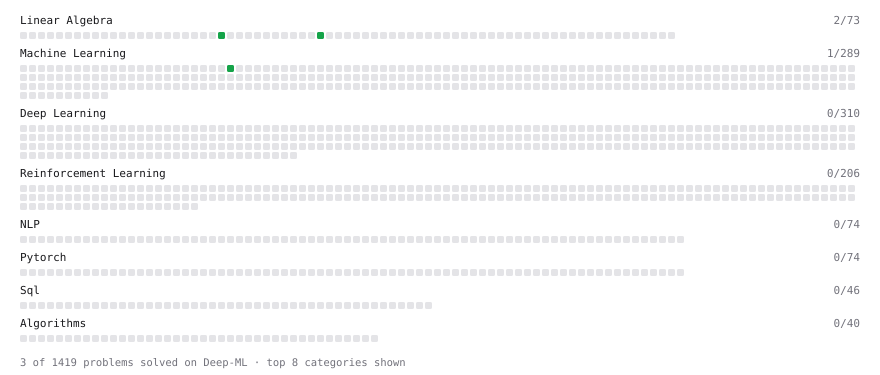

# Deep-ML

My machine learning practice from [Deep-ML](https://www.deep-ml.com). Every solution here was written by hand.

**23** solved · 4 problems · 0 labs · 19 math

[**Browse the interactive portfolio**](https://dai9u9r3jTienOofwm.github.io/deep-ml/) to replay this filling in over time.

## Problems

| | Difficulty | Solved | |
| --- | --- | --- | --- |
| [Implement Gini Impurity Calculation for a Set of Classes](https://www.deep-ml.com/problems/64) | easy | 2026-09-21 | [solution](problems/0064-implement-gini-impurity-calculation-for-a-set-of-classes) |
| [Implement Orthogonal Projection of a Vector onto a Line](https://www.deep-ml.com/problems/66) | easy | 2026-09-20 | [solution](problems/0066-implement-orthogonal-projection-of-a-vector-onto-a-line) |
| [Matrix Determinant & Trace](https://www.deep-ml.com/problems/195) | easy | 2026-09-20 | [solution](problems/0195-matrix-determinant-trace) |
| [Find the Best Gini-Based Split for a Binary Decision Tree](https://www.deep-ml.com/problems/138) | medium | 2026-09-21 | [solution](problems/0138-find-the-best-gini-based-split-for-a-binary-decision-tree) |

## Math

| | Difficulty | Solved | |
| --- | --- | --- | --- |
| [Expectation and Variance Algebra](https://www.deep-ml.com/math-problems/33) | easy | 2026-09-20 | [solution](math/0033-expectation-and-variance-algebra) |
| [Model Selection: CV, AIC, and BIC](https://www.deep-ml.com/math-problems/43) | easy | 2026-09-21 | [solution](math/0043-model-selection-cv-aic-and-bic) |
| [Bias–Variance Decomposition](https://www.deep-ml.com/math-problems/39) | medium | 2026-09-21 | [solution](math/0039-bias-variance-decomposition) |
| [Covariance and Correlation](https://www.deep-ml.com/math-problems/17) | medium | 2026-09-21 | [solution](math/0017-covariance-and-correlation) |
| [Determinants and Trace](https://www.deep-ml.com/math-problems/11) | medium | 2026-09-23 | [solution](math/0011-determinants-and-trace) |
| [Gram–Schmidt and Orthonormal Bases](https://www.deep-ml.com/math-problems/47) | medium | 2026-09-20 | [solution](math/0047-gram-schmidt-and-orthonormal-bases) |
| [Information Theory: Entropy](https://www.deep-ml.com/math-problems/24) | medium | 2026-09-21 | [solution](math/0024-information-theory-entropy) |
| [Inverse and Rank](https://www.deep-ml.com/math-problems/12) | medium | 2026-09-23 | [solution](math/0012-inverse-and-rank) |
| [Least Squares and the Normal Equations](https://www.deep-ml.com/math-problems/34) | medium | 2026-09-20 | [solution](math/0034-least-squares-and-the-normal-equations) |
| [Logistic Regression as Maximum Likelihood](https://www.deep-ml.com/math-problems/40) | medium | 2026-09-21 | [solution](math/0040-logistic-regression-as-maximum-likelihood) |
| [Margins and Soft-Margin SVMs](https://www.deep-ml.com/math-problems/42) | medium | 2026-09-21 | [solution](math/0042-margins-and-soft-margin-svms) |
| [Optimization: Convexity and Critical Points](https://www.deep-ml.com/math-problems/6) | medium | 2026-09-21 | [solution](math/0006-optimization-convexity-and-critical-points) |
| [Orthogonality and Projections](https://www.deep-ml.com/math-problems/14) | medium | 2026-09-20 | [solution](math/0014-orthogonality-and-projections) |
| [Pseudoinverse and Minimum-Norm Least Squares](https://www.deep-ml.com/math-problems/48) | medium | 2026-09-20 | [solution](math/0048-pseudoinverse-and-minimum-norm-least-squares) |
| [Regularization and Generalization](https://www.deep-ml.com/math-problems/31) | medium | 2026-09-21 | [solution](math/0031-regularization-and-generalization) |
| [Solving Linear Systems](https://www.deep-ml.com/math-problems/13) | medium | 2026-09-20 | [solution](math/0013-solving-linear-systems) |
| [The Four Fundamental Subspaces](https://www.deep-ml.com/math-problems/46) | medium | 2026-09-23 | [solution](math/0046-the-four-fundamental-subspaces) |
| [Eigendecomposition and SVD](https://www.deep-ml.com/math-problems/16) | hard | 2026-09-21 | [solution](math/0016-eigendecomposition-and-svd) |
| [Maximum Likelihood and MAP](https://www.deep-ml.com/math-problems/26) | hard | 2026-09-21 | [solution](math/0026-maximum-likelihood-and-map) |

---

_This file is regenerated by Deep-ML on every push._
